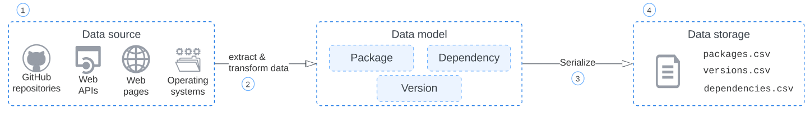

## Scripts Directory

This directory is used to store bash scripts used for running Vagrant miners, run all miners together, automate the creation and release of the dataset, etc.

## Automated release

We support automated releases to [Zenodo](https://zenodo.org/). In the following sections we explain the process and how to add a new miner to the release scripts.

### Steve

In our automated release flow, we run all the miners in parallel, compress the data and send it to [Zenodo](https://zenodo.org/). The image below illustrates the process.

A [Digital Ocean](https://www.digitalocean.com/) droplet (2GB Memory / 50GB Disk / AMS3 - Ubuntu 20.04 (LTS) x64) is always up and waiting for a new release to be triggered. When running the `.github/workflows/create_release.yml` Github Actions workflow, we manually start an automated release. In the workflow we connect to Steve via SSH, clone the latest DaSEA tool version and run the `bin/release/trigger_dataset_generation.sh` script in the background.

This script takes care of:

- Creating a file that serves as a storage of the miner status (not completed/completed)
- Triggering each miner in a seperate droplet (See scripts inside `bin/release/generate_dataset_scripts/*.sh`)
- Triggers the background check script `bin/release/background_check_completion_status.sh` that verifies the miner status (based on the process ID) every 15 minutes

Once all the miners have completed, which depends on the longest running miner in terms of time, Steve compresses the data folder and releases a new version of the dataset in Zenodo.

### Individual Miner Droplet

Steve creates individual droplets for each miner based on the scripts in `bin/release/generate_dataset_scripts/*.sh`. The only exception are the short-running miners, which are combined in the `bin/release/generate_dataset_scripts/non_vagrant_miners.sh`.

In each miner script:

- A new droplet instance with the required parameters is created, usualy 8 GB Memory / 160 GB Disk / AMS3 droplet, only NPM due to its size is a 16GB Memory / 320GB Disk / AMS3 droplet.
- SSH into the droplet, clone DaSEA tool and execute the miner
- On completion, copy the csv files back to Steve
- Destroy the droplet

### Adding a new miner to Steve

When adding a new miner to Steve, a new script needs to be added to include that miner in the automated release. If the miner execution time is under an hour, we recommend adding it to `bin/release/generate_dataset_scripts/non_vagrant_miners.sh` as an addition command to execute.

However, if the miner is long-running or requires some specific droplet parameters, an individual droplet is more suitable. Create a new script inside `bin/release/generate_dataset_scripts/new_miner_script.sh`, following the example of the other scripts (see the previous section for more details).

Afterwards, update `bin/release/background_check_completion_status.sh`:

- Add your miner to the json file on line 5, ex: `"new_miner_complete": false`
- Add your miner before the background check completion, where you call your new miner script, store its output in an individual log, store the miner process ID, and call `bin/release/background_check.sh` with the process ID, similar to the other miners.

### Debugging

We use the individual miner log files for debugging any issues on the corresponding miner

### Release

After all the miners have cmpleted, a new release is triggered via `bin/release/release_dataset.sh`, which compresses and pushes the bzip to Zenodo.

Finally, the latest release is pushed back to the DaSEA tool repository on GitHub, to update our homepage.
