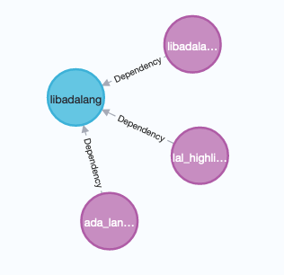
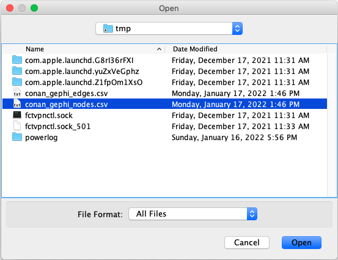
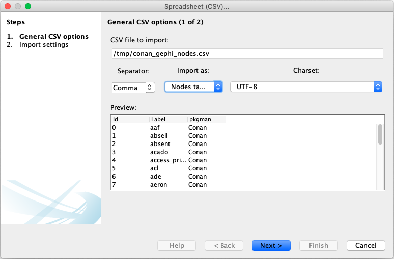
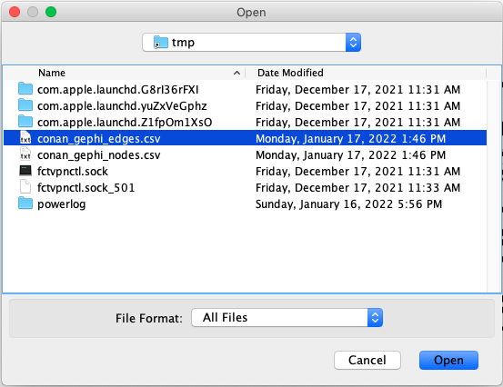
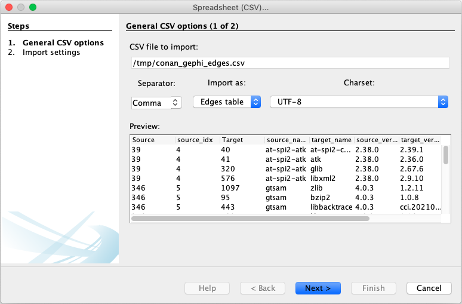
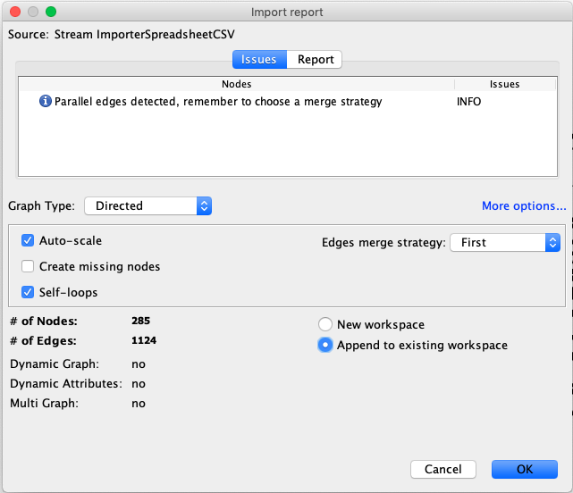
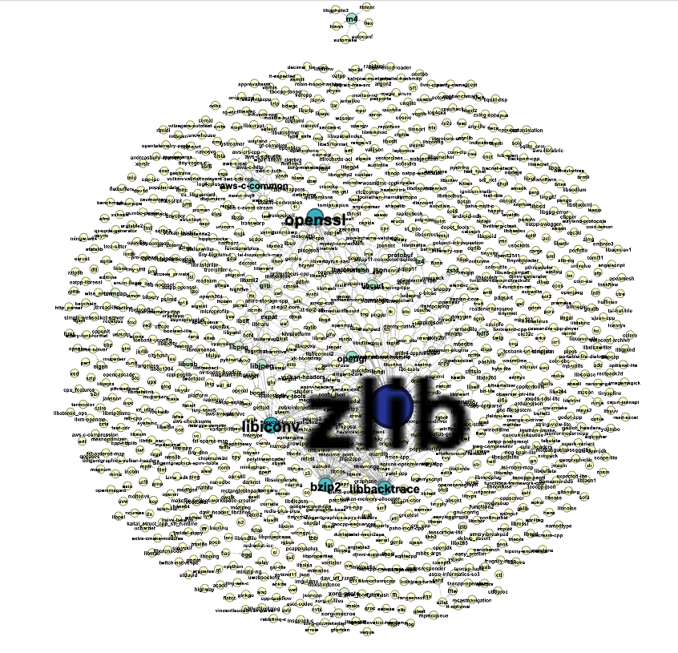

<!-- # Welcome to the DaSEA documentation
 -->


## Using the DaSEA Dataset

### Downloading the Dataset

All versions of the DaSEA dataset can be obtained from Zenodo: https://zenodo.org/record/5781670

The dataset is distributed as a compressed (BZip2) archive (TAR).
The filename of the dataset follows the pattern `dasea_%m-%d-%Y.tar.bz2`.
That is, The file `dasea_01-14-2022.tar.bz2` corresponds to the dataset that was released in Jan. 14th 2022.

The dataset can be downloaded from Zenodo for example as in the following:

TODO: update the link to the most current dataset!
```bash
wget https://zenodo.org/record/5781670/files/dasea_01-14-2022.tar.bz2
```


To get an overview over which ecosystems are included in the respective dataset before decompression, the files of the dataset can be listed:

```
$ tar -tvjf dasea_01-14-2022.tar.bz2
-rw-r--r--  0 user   staff    5162 Jan 14 15:16 data/out/alire/alire_packages_01-14-2022.csv
-rw-r--r--  0 user   staff   94991 Jan 14 15:16 data/out/alire/alire_versions_01-14-2022.csv
-rw-r--r--  0 user   staff   27035 Jan 14 15:16 data/out/alire/alire_dependencies_01-14-2022.csv
-rw-r--r--  0 user   staff  133668 Jan 14 15:18 data/out/homebrew/homebrew_packages_01-14-2022.csv
-rw-r--r--  0 user   staff 1093756 Jan 14 15:18 data/out/homebrew/homebrew_versions_01-14-2022.csv
-rw-r--r--  0 user   staff  669156 Jan 14 15:18 data/out/homebrew/homebrew_dependencies_01-14-2022.csv
-rw-r--r--  0 user   staff    1954 Jan 14 15:17 data/out/fpm/fpm_dependencies_01-14-2022.csv
-rw-r--r--  0 user   staff     663 Jan 14 15:17 data/out/fpm/fpm_packages_01-14-2022.csv
-rw-r--r--  0 user   staff    7011 Jan 14 15:17 data/out/fpm/fpm_versions_01-14-2022.csv
-rw-r--r--  0 user   staff  262594 Jan 14 15:17 data/out/vcpkg/vcpkg_versions_01-14-2022.csv
-rw-r--r--  0 user   staff   37836 Jan 14 15:17 data/out/vcpkg/vcpkg_packages_01-14-2022.csv
-rw-r--r--  0 user   staff  296420 Jan 14 15:17 data/out/vcpkg/vcpkg_dependencies_01-14-2022.csv
-rw-r--r--  0 user   staff   60884 Jan 14 15:17 data/out/conan/conan_dependencies_01-14-2022.csv
-rw-r--r--  0 user   staff   21328 Jan 14 15:17 data/out/conan/conan_packages_01-14-2022.csv
-rw-r--r--  0 user   staff  455922 Jan 14 15:17 data/out/conan/conan_versions_01-14-2022.csv
```

The output shows that in this version of the dataset contains the package dependency networks from the ADA package manager Alire, the MacOS package manager Homebrew, the Fortran package manager FPM, and the C/C++ package managers Conan and VCPKG.

### Decompressing the Dataset

The entire dataset can be decompressed with the tar command:

```bash
tar xf dasea_01-14-2022.tar.bz2
```

To only extract the dependency networks of a single package manager, or to extract only package information etc., the respective files can be extracted separately.
For example, the dependency network from the Fortran packages in FPM can be extracted as in the following:

```bash
tar -jxf dasea_01-14-2022.tar.bz2 data/out/fpm/fpm_packages_01-14-2022.csv
tar -jxf dasea_01-14-2022.tar.bz2 data/out/fpm/fpm_versions_01-14-2022.csv
tar -jxf dasea_01-14-2022.tar.bz2 data/out/fpm/fpm_dependencies_01-14-2022.csv
```

### Example use cases


#### SQL: Identify packages with highest in-degree


To count the in-degree

For brevity of the example, we use Pandas' `to_sql` function, which creates the database schema automatically in the background.

```python
import pandas as pd
from sqlalchemy import create_engine


db_engine = create_engine('sqlite://')  # in memory DB

deps_df = pd.read_csv("data/out/ports/netbsd9/netbsd9_dependencies_01-14-2022.csv")
# deps_df = pd.read_csv("data/out/alire/alire_dependencies_01-14-2022.csv")
deps_df.to_sql("Dependencies", db_engine)

query = """SELECT target_name, COUNT(target_name) AS indegree FROM Dependencies
GROUP BY target_name ORDER BY indegree DESC
LIMIT 10;"""

print(pd.read_sql(query, db_engine).to_html())
```

<table border="1" class="dataframe">
  <thead>
    <tr style="text-align: right;">
      <th></th>
      <th>target_name</th>
      <th>indegree</th>
    </tr>
  </thead>
  <tbody>
    <tr>
      <th>0</th>
      <td>pkgtools/cwrappers</td>
      <td>18194</td>
    </tr>
    <tr>
      <th>1</th>
      <td>pkgtools/x11-links</td>
      <td>2852</td>
    </tr>
    <tr>
      <th>2</th>
      <td>x11/xorgproto</td>
      <td>2465</td>
    </tr>
    <tr>
      <th>3</th>
      <td>x11/xcb-proto</td>
      <td>2025</td>
    </tr>
    <tr>
      <th>4</th>
      <td>x11/qt4-tools</td>
      <td>415</td>
    </tr>
    <tr>
      <th>5</th>
      <td>devel/boost-headers</td>
      <td>332</td>
    </tr>
    <tr>
      <th>6</th>
      <td>devel/extra-cmake-modules</td>
      <td>322</td>
    </tr>
    <tr>
      <th>7</th>
      <td>misc/ocaml-opaline</td>
      <td>252</td>
    </tr>
    <tr>
      <th>8</th>
      <td>devel/p5-Module-Build</td>
      <td>223</td>
    </tr>
    <tr>
      <th>9</th>
      <td>devel/pcre2</td>
      <td>158</td>
    </tr>
  </tbody>
</table>

The results in the table above show that almost all _pkgsrc_ packages (from NetBSD) depend on the [`pkgtools/cwrappers`](https://cdn.netbsd.org/pub/pkgsrc/current/pkgsrc/pkgtools/cwrappers/index.html) package.
It has an indegree of 18194 (in `netbsd9_packages_01-14-2022.csv` are 18197 packages registered).
The package with the second highest in-degree is [`pkgtools/x11-links`](https://cdn.netbsd.org/pub/pkgsrc/current/pkgsrc/pkgtools/x11-links/index.html) with 2852 packages that depend on it.


#### NetworkX: Computing Betweenness Centrality of packages


The Python package [NetworkX](https://networkx.org/) can [read and write a plethora of graph formats](https://networkx.org/documentation/stable/reference/readwrite/index.html).
One of them are adjacency lists, which are simple text files containing node identifiers.
To compute the [_Betweenness Centrality_](https://networkx.org/documentation/stable/reference/algorithms/generated/networkx.algorithms.centrality.betweenness_centrality.html#networkx.algorithms.centrality.betweenness_centrality) of the packages in the dependency network of Alire (a package manager for ADA), we first create an adjacency list from the CSV files that contain information about packages and dependencies.
The former is needed, since packages do not necessarily depend on other packages not are dependent of others.


<!-- [_"Graph Algorithms: Practical Examples in Apache Spark and Neo4j"_](https://www.academia.edu/download/62067087/Graph_Algorithms_Neo4j20200211-122044-3inq88.pdf)
 -->


```python
import tempfile
import pandas as pd
import networkx as nx
from pathlib import Path


def create_adjacency_lists():
    pkgs_df = pd.read_csv("data/out/conan/conan_packages_01-14-2022.csv")
    deps_df = pd.read_csv("data/out/conan/conan_dependencies_01-14-2022.csv")
    deps_df = deps_df[(~deps_df.pkg_idx.isnull()) & (~deps_df.target_idx.isnull())]

    fname = Path(tempfile.gettempdir(), "conan.adjl")
    with open(fname, "w") as fp:
        for node_id in pkgs_df.idx:
            print(node_id, file=fp)
        for _, (source_id, target_id) in deps_df[["pkg_idx", "target_idx"]].iterrows():
              print(int(source_id), int(target_id), file=fp)
    return fname


g = nx.read_adjlist(create_adjacency_lists(), nodetype=int, create_using=nx.DiGraph)
betweennes_ranks = nx.betweenness_centrality(g)
print(list(sorted(betweennes_ranks.items(), key=lambda item: item[1], reverse=True))[:10])
```

The program above generates an output similar to the following.

```
[(738, 1.4423449396770137e-05),
 (83, 4.807816465590045e-06),
 (455, 4.120985541934325e-06),
 (520, 3.2967884335474596e-06),
 (799, 2.0604927709671624e-06),
 (40, 1.6483942167737298e-06),
 (200, 1.6483942167737298e-06),
 (356, 1.6483942167737298e-06),
 (472, 1.6483942167737298e-06),
 (163, 1.5110280320425857e-06)]
```

The printed results show, that the package with identifier 738 has the highest Betweenness Centrality.
That package is [`openssl`](https://conan.io/center/openssl).
The package with the second highest Betweenness Centrality is [`boost`](https://conan.io/center/boost) (identifier 83).

Note, the program above does not illustrate the programmatic lookup of package names from identifier.


#### Neo4j: Finding versions of packages with a specific requirement

Neo4j databases can be created from the DaSEA CSV files.
The only requirement is, that columns are named in a certain way as described in the [official documentation](https://neo4j.com/developer/guide-import-csv/).
For example, all the integer indexes that are used in the DaSEA dataset have to be named in a Neo4j specific manner so that graph nodes of the appropriate type are generated and that relations connect the respective nodes.
The following is an excerpt from the [example script](neo4j_example/convert_headers_to_neo4j.py) that converts the headers of the CSV files corresponding to the Alire ecosystem into a header suitable for Neo4j.

```python
pkg_df.rename(columns={"idx": "pkgId:ID(Package)"}, inplace=True)
ver_df.rename(columns={"idx": "verId:ID(Version)"}, inplace=True)
dep_df.rename(columns={"source_idx": "verId:START_ID(Version)", "target_idx": "pkgId:END_ID(Package)"}, inplace=True)
```

After converting the CSV files into the right format for bulk import into Neo4j, one could start-up a Neo4j database for example via Docker as below.

```bash
$ docker run \
      --name depgraphneo4j \
      -p7474:7474 -p7687:7687 \
      -d \
      -v $(pwd)/data:/var/lib/neo4j/import \
      --env NEO4J_AUTH=neo4j/password \
      neo4j:4.4.3
```

The actual data import from the DaSEA dataset with Neo4j specific headers could be done as in the following.

```bash
$ docker exec depgraphneo4j neo4j-admin import --force \
      --nodes=Package=/var/lib/neo4j/import/alire_packages_neo4j.csv \
      --nodes=Version=/var/lib/neo4j/import/alire_versions_neo4j.csv \
      --relationships=Dependency=/var/lib/neo4j/import/alire_dependencies_neo4j.csv \
      --relationships=VersionOf=/var/lib/neo4j/import/alire_instancerels_neo4j.csv \
      --skip-bad-relationships
```

Once the data is imported, the database engine needs to be restarted:

```bash
$ docker container restart depgraphneo4j
```

Thereafter, a Cypher query that searches for any version of a package that depends on a version of package `libadalang` would return respectively one version of `ada_language_server`, `libadalang_tools`, and `lal_highlight`, see the illustration below.

```sql
MATCH (dep:Version)-[:Dependency]->(n:Package {name: 'libadalang'}) RETURN n,dep
```



A complete example can be found in [](./neo4j_example/).


#### Pandas: Identify Conan packages that changed licenses between versions 

Let's say we want to find the names of all packages from the Conan package managers that changed licenses between versions.
Using the Python data analysis library [Pandas](https://pandas.pydata.org/), one could analyze the versions CSV file of the Conan dataset as in the following.
There, we load the respective CSV file into a Pandas `DataFrame` and subsequently identify all those Conan packages (`groupby("pkg_idx")`) which had more than one license over multiple versions (`filter(lambda x: len(set(x.license)) > 1)`).
To store the names and the licenses of these package in another `DataFrame` (`rdf`), one could group the previous results by package name (`groupby("name")`) and create a set of given licenses (`apply(lambda x: set(x.license))`).  

```python
import pandas as pd


df = pd.read_csv("data/out/conan/conan_versions_01-14-2022.csv")
rdf = df.groupby("pkg_idx").filter(lambda x: len(set(x.license)) > 1).groupby("name").apply(lambda x: set(x.license)).reset_index(name="licenses")
print(rdf.to_html())
```

The above program identifies ten Conan packages for which licenses change during their existence.
Their names and licenses as stored in the resulting `DataFrame` (`rdf`) are:

<table border="1" class="dataframe">
  <thead>
    <tr style="text-align: right;">
      <th></th>
      <th>name</th>
      <th>licenses</th>
    </tr>
  </thead>
  <tbody>
    <tr>
      <th>0</th>
      <td>bzip2</td>
      <td>{['bzip2-1.0.6'], ['bzip2-1.0.8']}</td>
    </tr>
    <tr>
      <th>1</th>
      <td>freetype</td>
      <td>{['bzip2-1.0.8'], ['MIT']}</td>
    </tr>
    <tr>
      <th>2</th>
      <td>mbedtls</td>
      <td>{['Apache-2.0'], ['GPL-2.0', 'Apache-2.0']}</td>
    </tr>
    <tr>
      <th>3</th>
      <td>mosquitto</td>
      <td>{['EPL-2.0'], ['MIT']}</td>
    </tr>
    <tr>
      <th>4</th>
      <td>opencv</td>
      <td>{['Apache-2.0'], ['MPL-2.0', 'LGPL-3.0-or-later']}</td>
    </tr>
    <tr>
      <th>5</th>
      <td>openssl</td>
      <td>{['Apache-2.0'], ['OpenSSL']}</td>
    </tr>
    <tr>
      <th>6</th>
      <td>poco</td>
      <td>{['Apache-2.0'], ['bzip2-1.0.8']}</td>
    </tr>
    <tr>
      <th>7</th>
      <td>proj</td>
      <td>{['GPL-2.0'], ['MIT']}</td>
    </tr>
    <tr>
      <th>8</th>
      <td>rmlui</td>
      <td>{['bzip2-1.0.8'], ['MIT']}</td>
    </tr>
    <tr>
      <th>9</th>
      <td>vulkan-validationlayers</td>
      <td>{['MIT-KhronosGroup'], ['MIT']}</td>
    </tr>
    <tr>
      <th>10</th>
      <td>zbar</td>
      <td>{['LGPL-2.1'], ['LGPL-2.1-only']}</td>
    </tr>
  </tbody>
</table>

Note, that the given licenses are not in chronological order.
For that, the above program would have to be modified.


#### Gephi: Visualize an ecosystem

The graph visualization program [Gephi](https://gephi.org/) can read graphs from many [kinds of files](https://gephi.org/users/supported-graph-formats/).
Amongst others it supports reading CSV files.
However, it requires that CSV files with graph nodes contain at least two columns with names `Id` and `Label` respectively.
CSV files storing edges must specify the ends of edges in fields called `Source` and `Target` respectively.
See the [linked tutorial](https://seinecle.github.io/gephi-tutorials/generated-html/importing-csv-data-in-gephi-en.html) for details of importing CSV data.
The columns of the DaSEA dataset are called differently though.

The following program illustrates how to convert a packages CSV file and a dependency CSV file from the Conan ecosystem into two CSV files of a format that Gephi can digest.


```python
import pandas as pd
from pathlib import Path


pkgs_df = pd.read_csv("data/out/conan/conan_packages_01-14-2022.csv")
pkgs_df.rename(columns={"idx": "Id", "name": "Label"}, inplace=True)
pkgs_df.to_csv(Path("/tmp", "conan_gephi_nodes.csv"), index=False)

deps_df = pd.read_csv("data/out/conan/conan_dependencies_01-14-2022.csv")

deps_df = deps_df[(~deps_df.pkg_idx.isnull()) & (~deps_df.target_idx.isnull())]
deps_df.pkg_idx = deps_df.pkg_idx.astype(np.uint)
deps_df.rename(columns={"pkg_idx": "Source", "target_idx": "Target"}, inplace=True)
deps_df.to_csv(Path("/tmp", "conan_gephi_edges.csv"), index=False)
```

The screenshots below illustrate the process of importing nodes and edges from their respective CSV files.







After a bit of cosmetic changes to the Conan dependency network, i.e., Noverlap layout algorithm and node sizes and colors according to a nodes PageRank, a visualization of Conan's package dependency network look like in the following:




<!-- 

 the most common licenses with pandas
 -->