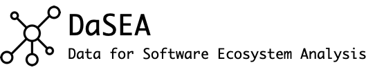

<!-- # Welcome to the DaSEA documentation
 -->



## Using the DaSEA Dataset

### Downloading the Dataset

All versions of the DaSEA dataset can be obtained from Zenodo: https://zenodo.org/record/5781670

The dataset is distributed as a compressed (BZip2) archive (TAR).
The filename of the dataset follows the pattern `dasea_%m-%d-%Y.tar.bz2`.
That is, The file `dasea_01-14-2022.tar.bz2` corresponds to the dataset that was released in Jan. 14th 2022.

The dataset can be downloaded from Zenodo for example as in the following:

TODO: update the link to the most current dataset!
```bash
wget https://zenodo.org/record/5781670/files/dasea_01-14-2022.tar.bz2
```


To get an overview over which ecosystems are included in the respective dataset before decompression, the files of the dataset can be listed:

```
$ tar -tvjf dasea_01-14-2022.tar.bz2
-rw-r--r--  0 user   staff    5162 Jan 14 15:16 data/out/alire/alire_packages_01-14-2022.csv
-rw-r--r--  0 user   staff   94991 Jan 14 15:16 data/out/alire/alire_versions_01-14-2022.csv
-rw-r--r--  0 user   staff   27035 Jan 14 15:16 data/out/alire/alire_dependencies_01-14-2022.csv
-rw-r--r--  0 user   staff  133668 Jan 14 15:18 data/out/homebrew/homebrew_packages_01-14-2022.csv
-rw-r--r--  0 user   staff 1093756 Jan 14 15:18 data/out/homebrew/homebrew_versions_01-14-2022.csv
-rw-r--r--  0 user   staff  669156 Jan 14 15:18 data/out/homebrew/homebrew_dependencies_01-14-2022.csv
-rw-r--r--  0 user   staff    1954 Jan 14 15:17 data/out/fpm/fpm_dependencies_01-14-2022.csv
-rw-r--r--  0 user   staff     663 Jan 14 15:17 data/out/fpm/fpm_packages_01-14-2022.csv
-rw-r--r--  0 user   staff    7011 Jan 14 15:17 data/out/fpm/fpm_versions_01-14-2022.csv
-rw-r--r--  0 user   staff  262594 Jan 14 15:17 data/out/vcpkg/vcpkg_versions_01-14-2022.csv
-rw-r--r--  0 user   staff   37836 Jan 14 15:17 data/out/vcpkg/vcpkg_packages_01-14-2022.csv
-rw-r--r--  0 user   staff  296420 Jan 14 15:17 data/out/vcpkg/vcpkg_dependencies_01-14-2022.csv
-rw-r--r--  0 user   staff   60884 Jan 14 15:17 data/out/conan/conan_dependencies_01-14-2022.csv
-rw-r--r--  0 user   staff   21328 Jan 14 15:17 data/out/conan/conan_packages_01-14-2022.csv
-rw-r--r--  0 user   staff  455922 Jan 14 15:17 data/out/conan/conan_versions_01-14-2022.csv
```

The output shows that in this version of the dataset contains the package dependency networks from the ADA package manager Alire, the MacOS package manager Homebrew, the Fortran package manager FPM, and the C/C++ package managers Conan and VCPKG.

### Decompressing the Dataset

The entire dataset can be decompressed with the tar command:

```bash
tar xf dasea_01-14-2022.tar.bz2
```

To only extract the dependency networks of a single package manager, or to extract only package information etc., the respective files can be extracted separately.
For example, the dependency network from the Fortran packages in FPM can be extracted as in the following:

```bash
tar -jxf dasea_01-14-2022.tar.bz2 data/out/fpm/fpm_packages_01-14-2022.csv
tar -jxf dasea_01-14-2022.tar.bz2 data/out/fpm/fpm_versions_01-14-2022.csv
tar -jxf dasea_01-14-2022.tar.bz2 data/out/fpm/fpm_dependencies_01-14-2022.csv
```

### Example use cases


#### SQL: Identify packages with highest in-degree


```python
import pandas as pd
from sqlalchemy import create_engine


db_engine = create_engine('sqlite://')  # in memory DB

# dependencies_df = pd.read_csv("data/out/ports/netbsd9/netbsd9_versions_01-14-2022.csv")
deps_df = pd.read_csv("data/out/alire/alire_dependencies_01-14-2022.csv")
deps_df.to_sql("Dependencies", db_engine)

query = """SELECT target_name, COUNT(target_name) AS indegree FROM Dependencies
GROUP BY target_name ORDER BY indegree DESC
LIMIT 10;"""

print(pd.read_sql(query, db_engine).to_html())
```


<table border="1" class="dataframe">
  <thead>
    <tr style="text-align: right;">
      <th></th>
      <th>target_name</th>
      <th>indegree</th>
    </tr>
  </thead>
  <tbody>
    <tr>
      <th>0</th>
      <td>matreshka_league</td>
      <td>62</td>
    </tr>
    <tr>
      <th>1</th>
      <td>hal</td>
      <td>32</td>
    </tr>
    <tr>
      <th>2</th>
      <td>gnatcoll</td>
      <td>31</td>
    </tr>
    <tr>
      <th>3</th>
      <td>gnat</td>
      <td>28</td>
    </tr>
    <tr>
      <th>4</th>
      <td>utilada</td>
      <td>19</td>
    </tr>
    <tr>
      <th>5</th>
      <td>cortex_m</td>
      <td>13</td>
    </tr>
    <tr>
      <th>6</th>
      <td>xmlada</td>
      <td>11</td>
    </tr>
    <tr>
      <th>7</th>
      <td>libusb</td>
      <td>11</td>
    </tr>
    <tr>
      <th>8</th>
      <td>libhidapi</td>
      <td>11</td>
    </tr>
    <tr>
      <th>9</th>
      <td>make</td>
      <td>10</td>
    </tr>
  </tbody>
</table>

#### NetworkX: Computing the PageRanks of all XXX Packages with


```python
import pandas as pd
import networkx as nx


df = pd.read_csv("data/out/conan/conan_versions_01-14-2022.csv")

```


#### Neo4j: Finding the Longest-Dependency Paths in XXX with Neo4j


#### Pandas: Identify Conan packages that changed licenses between versions 

Let's say we want to find the names of all packages from the Conan package managers that changed licenses between versions.
Using the Python data analysis library [Pandas](https://pandas.pydata.org/), one could analyze the versions CSV file of the Conan dataset as in the following.
There, we load the respective CSV file into a Pandas `DataFrame` and subsequently identify all those Conan packages (`groupby("pkg_idx")`) which had more than one license over multiple versions (`filter(lambda x: len(set(x.license)) > 1)`).
To store the names and the licenses of these package in another `DataFrame` (`rdf`), one could group the previous results by package name (`groupby("name")`) and create a set of given licenses (`apply(lambda x: set(x.license))`).  

```python
import pandas as pd


df = pd.read_csv("data/out/conan/conan_versions_01-14-2022.csv")

# TODO: licenses to lists
rdf = df.groupby("pkg_idx").filter(lambda x: len(set(x.license)) > 1).groupby("name").apply(lambda x: set(x.license)).reset_index(name="licenses")
print(rdf.to_html())
```

The above program identifies ten Conan packages for which licenses change during their existence.
Their names and licenses as stored in the resulting `DataFrame` (`rdf`) are:

<table border="1" class="dataframe">
  <thead>
    <tr style="text-align: right;">
      <th></th>
      <th>name</th>
      <th>licenses</th>
    </tr>
  </thead>
  <tbody>
    <tr>
      <th>0</th>
      <td>bzip2</td>
      <td>{['bzip2-1.0.6'], ['bzip2-1.0.8']}</td>
    </tr>
    <tr>
      <th>1</th>
      <td>freetype</td>
      <td>{['bzip2-1.0.8'], ['MIT']}</td>
    </tr>
    <tr>
      <th>2</th>
      <td>mbedtls</td>
      <td>{['Apache-2.0'], ['GPL-2.0', 'Apache-2.0']}</td>
    </tr>
    <tr>
      <th>3</th>
      <td>mosquitto</td>
      <td>{['EPL-2.0'], ['MIT']}</td>
    </tr>
    <tr>
      <th>4</th>
      <td>opencv</td>
      <td>{['Apache-2.0'], ['MPL-2.0', 'LGPL-3.0-or-later']}</td>
    </tr>
    <tr>
      <th>5</th>
      <td>openssl</td>
      <td>{['Apache-2.0'], ['OpenSSL']}</td>
    </tr>
    <tr>
      <th>6</th>
      <td>poco</td>
      <td>{['Apache-2.0'], ['bzip2-1.0.8']}</td>
    </tr>
    <tr>
      <th>7</th>
      <td>proj</td>
      <td>{['GPL-2.0'], ['MIT']}</td>
    </tr>
    <tr>
      <th>8</th>
      <td>rmlui</td>
      <td>{['bzip2-1.0.8'], ['MIT']}</td>
    </tr>
    <tr>
      <th>9</th>
      <td>vulkan-validationlayers</td>
      <td>{['MIT-KhronosGroup'], ['MIT']}</td>
    </tr>
    <tr>
      <th>10</th>
      <td>zbar</td>
      <td>{['LGPL-2.1'], ['LGPL-2.1-only']}</td>
    </tr>
  </tbody>
</table>

Note, that the given licenses are not in chronological order.
For that, the above program would have to be modified.


 the most common licenses with pandas


```python
engine = create_engine('sqlite:///school.db', echo=True)
```